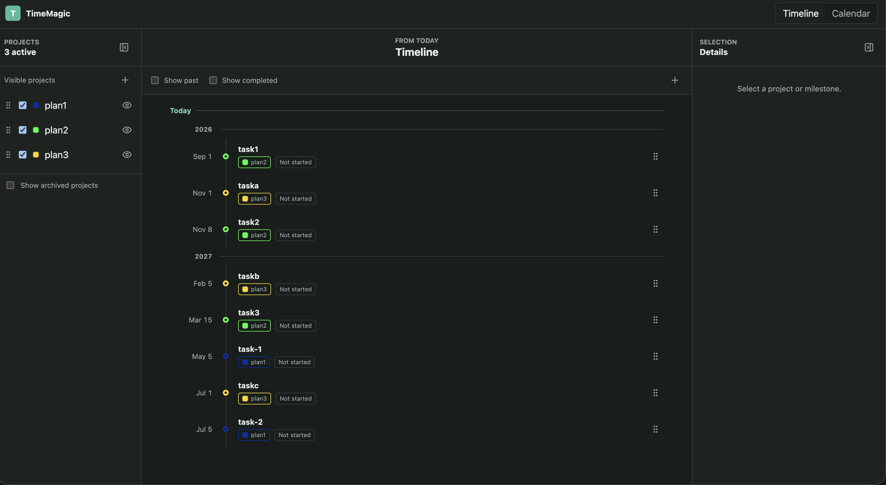
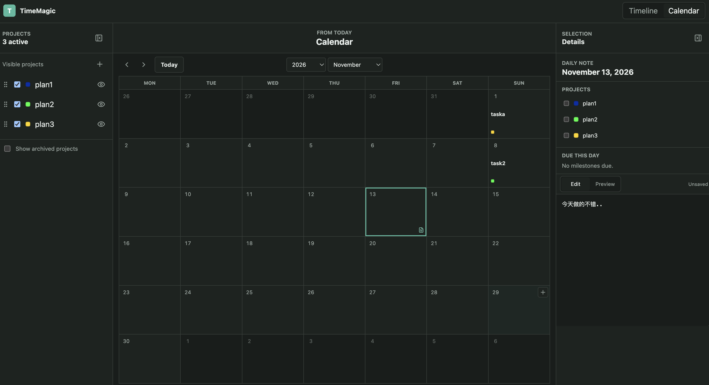

# TimeMagic

TimeMagic is a local-first personal planning app for managing long-running goals through a timeline, calendar, project groups, and Markdown notes.

The current app focuses on a compact workflow:

- Plan important deadlines as timeline milestones.
- Group milestones by project.
- Archive and restore projects without losing their data.
- View milestones on a monthly calendar.
- Write daily Markdown notes and associate each day with one or more projects.
- Select a timeline milestone, switch to Calendar, and land directly on that milestone's month.

## App Shape

TimeMagic has three main panes:

- **Projects**: active and archived groups, visibility toggles, project editing.
- **Timeline / Calendar**: switchable primary view for milestone planning and monthly review.
- **Details**: selected project, milestone, or daily note editor.

Timeline is intentionally dense: milestones are vertical, ordered by date, include compact date labels, group tags, status, and year separators only when crossing into a new year.

Calendar shows a six-week month grid with direct year/month controls, milestone summaries, project color markers, daily note markers, and quick milestone creation for a day.

### Timeline



### Calendar and Daily Notes



## Tech Stack

- Monorepo: `pnpm` workspaces
- Web: React, Vite, TanStack Query, Testing Library
- Server: Fastify, Drizzle ORM, better-sqlite3
- Shared contracts: TypeScript + Zod
- E2E: Playwright

## Repository Layout

```text
apps/
  server/       Fastify API, SQLite persistence, document storage
  web/          React app
packages/
  shared/       Shared schemas, date helpers, calendar utilities
tests/
  e2e/          Playwright scenarios
docs/
  design/       API and domain design notes
  superpowers/  Working specs and implementation plans
data/           Local development database and Markdown documents
```

## Local Development

The workspace pins Node.js 24.20.0 through pnpm. On the first install, pnpm
downloads that runtime into its own store and uses it for project scripts. This
does not replace a Homebrew or system Node installation and does not modify your
shell `PATH`.

Install dependencies:

```bash
pnpm install
```

Before running the end-to-end tests for the first time, install the Playwright
browsers:

```bash
pnpm exec playwright install
```

Confirm the project runtime and native SQLite addon before starting:

```bash
pnpm exec node -v
pnpm check:native
```

The expected Node version is `v24.20.0`. The native check runs automatically
before `pnpm dev`; if the Node ABI changes during an intentional runtime
upgrade, rebuild the addon with `pnpm rebuild better-sqlite3`.

Run the app:

```bash
pnpm dev
```

The default dev command starts:

- API server on `http://127.0.0.1:4317`
- Web app on `http://localhost:4318`

Open:

```text
http://localhost:4318/#token=timemagic-dev
```

The startup token protects local API routes. In development, `pnpm dev` sets:

```bash
TIMEMAGIC_STARTUP_TOKEN=timemagic-dev
TIMEMAGIC_DATA_ROOT=../../data
```

If you start server/web commands manually, make sure both values are set intentionally.

## Data Storage

Local data lives under `data/` by default:

- SQLite database: application records, project groups, milestones, document metadata.
- Markdown documents: daily notes and milestone-related documents.

Daily note documents are stored under date-based paths such as:

```text
data/docs/daily/YYYY/MM/YYYY-MM-DD.md
```

Keep this in mind when running from a git worktree: a plain `pnpm dev` inside a worktree may point at that worktree's own `data/` directory. To use the original dataset, start with an absolute data root:

```bash
TIMEMAGIC_STARTUP_TOKEN=timemagic-dev \
TIMEMAGIC_DATA_ROOT=/Users/s1mo/demos/TimeMagic/data \
pnpm exec concurrently -k -n server,web \
  "pnpm --filter @timemagic/server dev" \
  "pnpm --filter @timemagic/web dev"
```

## Useful Commands

```bash
pnpm build
pnpm check:native
pnpm typecheck
pnpm test
pnpm test:e2e
```

Focused examples:

```bash
pnpm --filter @timemagic/web test
pnpm --filter @timemagic/server test
pnpm --filter @timemagic/web exec vitest run src/app/App.test.tsx
```

## Current Feature Notes

- Timeline milestone selection is preserved in the Details pane.
- Switching from a selected timeline milestone to Calendar opens the milestone's month.
- Calendar manual navigation is respected after opening; it is not repeatedly reset by the selected milestone.
- Selecting a calendar day switches Details to that day's daily note and clears the milestone selection.
- Daily notes can be linked to multiple project groups.

## Development Notes

- Prefer updating shared schemas in `packages/shared` before wiring API and UI behavior.
- Keep local documents and database changes out of commits unless explicitly intended.
- Run `pnpm test:e2e` before considering user-facing calendar or timeline flows complete.
